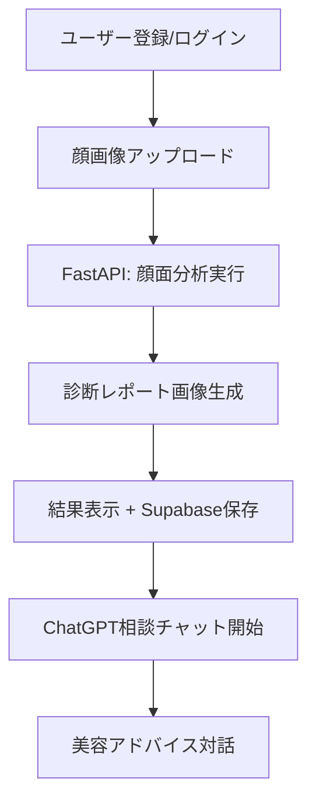
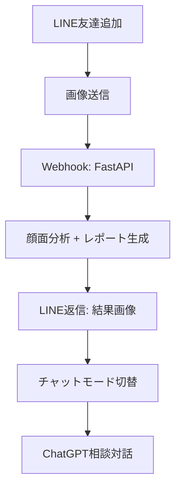

# Face Aesthetic App - プロジェクト構造設計

## 📋 プロジェクト概要
韓国の美意識と黄金比に基づく顔面美容分析AI + ChatGPT相談チャットボット

### 🎯 対象プラットフォーム
- ✅ Web版（Next.js + FastAPI）
- ✅ LINE Bot版 
- 🔮 Flutter版（将来）

### 🛠 技術スタック
- **Backend**: Python 3.12+ / FastAPI / Pydantic v2 / uv
- **Frontend**: Next.js 15+ / TypeScript / Tailwind CSS
- **Database**: Supabase (PostgreSQL + Storage + Auth)
- **AI/ML**: MediaPipe + OpenAI GPT-4o-mini
- **Deploy**: Docker + Docker Compose

## 📁 ディレクトリ構造

```
face-aesthetic-app/
├── README.md
├── docker-compose.yml
├── .env.example
├── .gitignore
│
├── backend/                          # Python FastAPI バックエンド
│   ├── pyproject.toml               # uv package管理
│   ├── uv.lock
│   ├── Dockerfile
│   ├── .env.example
│   │
│   ├── app/
│   │   ├── __init__.py
│   │   ├── main.py                  # FastAPI エントリーポイント
│   │   ├── config.py                # 設定管理
│   │   │
│   │   ├── core/                    # コア機能
│   │   │   ├── __init__.py
│   │   │   ├── facial_analyzer.py   # 顔面分析（v2移植）
│   │   │   ├── report_generator.py  # 診断レポート画像生成
│   │   │   └── chatbot_service.py   # ChatGPT統合
│   │   │
│   │   ├── api/                     # API エンドポイント
│   │   │   ├── __init__.py
│   │   │   ├── v1/
│   │   │   │   ├── __init__.py
│   │   │   │   ├── auth.py         # 認証API
│   │   │   │   ├── analysis.py     # 顔面分析API
│   │   │   │   ├── chat.py         # チャットボットAPI
│   │   │   │   └── linebot.py      # LINE Bot Webhook
│   │   │   └── deps.py             # 依存性注入
│   │   │
│   │   ├── models/                  # Pydantic モデル
│   │   │   ├── __init__.py
│   │   │   ├── user.py
│   │   │   ├── analysis.py
│   │   │   └── chat.py
│   │   │
│   │   ├── schemas/                 # DB スキーマ
│   │   │   ├── __init__.py
│   │   │   └── supabase.py
│   │   │
│   │   ├── services/                # ビジネスロジック
│   │   │   ├── __init__.py
│   │   │   ├── auth_service.py
│   │   │   ├── analysis_service.py
│   │   │   ├── storage_service.py   # Supabase Storage
│   │   │   └── notification_service.py
│   │   │
│   │   └── utils/                   # ユーティリティ
│   │       ├── __init__.py
│   │       ├── image_processing.py
│   │       ├── validators.py
│   │       └── exceptions.py
│   │
│   └── tests/                       # テスト
│       ├── __init__.py
│       ├── conftest.py
│       ├── test_facial_analyzer.py
│       ├── test_api/
│       └── test_services/
│
├── frontend/                        # Next.js フロントエンド
│   ├── package.json
│   ├── next.config.js
│   ├── tailwind.config.js
│   ├── tsconfig.json
│   ├── Dockerfile
│   ├── .env.example
│   │
│   ├── src/
│   │   ├── app/                     # App Router
│   │   │   ├── layout.tsx
│   │   │   ├── page.tsx            # ホーム
│   │   │   ├── login/
│   │   │   ├── dashboard/
│   │   │   ├── analysis/
│   │   │   │   ├── upload/         # アップロード画面
│   │   │   │   └── result/         # 結果表示
│   │   │   └── chat/               # チャットボット
│   │   │
│   │   ├── components/              # React コンポーネント
│   │   │   ├── ui/                 # 基本UI
│   │   │   ├── auth/               # 認証関連
│   │   │   ├── analysis/           # 分析関連
│   │   │   └── chat/               # チャット関連
│   │   │
│   │   ├── lib/                     # ユーティリティ
│   │   │   ├── supabase.ts
│   │   │   ├── api.ts
│   │   │   └── utils.ts
│   │   │
│   │   ├── hooks/                   # カスタムフック
│   │   ├── types/                   # TypeScript型定義
│   │   └── styles/                  # スタイル
│   │
│   └── public/                      # 静的ファイル
│
├── docs/                            # ドキュメント
│   ├── SUPABASE_SETUP.md           # Supabase設定手順
│   ├── LINEBOT_SETUP.md            # LINE Bot設定手順
│   ├── API_DOCS.md                 # API仕様
│   └── DEPLOYMENT.md               # デプロイ手順
│
└── legacy/                          # 既存ファイル保管
    ├── facial_beauty_analyzer_v2.py
    ├── demo_integrated_output.py
    └── main.py
```

## 🔄 アプリケーションフロー

### 1. Web版フロー


### 2. LINE Bot版フロー


## 🎨 主要機能

### Backend (FastAPI)
- **顔面分析API**: MediaPipe + 既存アルゴリズム
- **レポート生成**: PIL/matplotlib で視覚的診断書
- **ChatGPT統合**: 美容相談チャットボット
- **LINE Bot**: Messaging API対応
- **認証**: Supabase Auth
- **ファイル管理**: Supabase Storage

### Frontend (Next.js)
- **SPA**: シングルページアプリケーション
- **リアルタイムチャット**: WebSocket or SSE
- **レスポンシブデザイン**: モバイル対応
- **画像プレビュー**: ドラッグ&ドロップ
- **結果可視化**: チャート・グラフ表示

### Database (Supabase)
```sql
-- users テーブル (Supabase Auth連携)
-- analysis_results テーブル (分析結果)
-- chat_sessions テーブル (チャット履歴)
-- images テーブル (画像メタデータ)
```

## 🚀 開発優先順位

### Phase 1: コア機能 (Week 1-2)
1. ✅ FastAPI基盤 + 顔面分析移植
2. ✅ Supabaseセットアップ
3. ✅ 基本API (分析・結果保存)
4. ✅ Next.js基本画面

### Phase 2: 統合機能 (Week 3-4)
1. ✅ レポート画像生成
2. ✅ ChatGPT API統合
3. ✅ Web版完成
4. ✅ テスト実装

### Phase 3: 拡張機能 (Week 5-6)
1. ✅ LINE Bot開発
2. ✅ Docker化
3. ✅ デプロイ設定
4. ✅ ドキュメント整備

## 🔐 セキュリティ・考慮事項

- **画像処理**: サイズ制限・フォーマット検証
- **API制限**: Rate limiting (FastAPI middleware)
- **認証**: Supabase JWT + Row Level Security
- **環境変数**: 秘匿情報の適切な管理
- **CORS**: フロントエンド-バックエンド通信
- **画像保存**: Supabaseの自動削除設定

## 📊 パフォーマンス目標

- **分析処理**: 3秒以内
- **画像アップロード**: 10MB以下対応
- **チャット応答**: 2秒以内
- **同時接続**: 100ユーザー対応