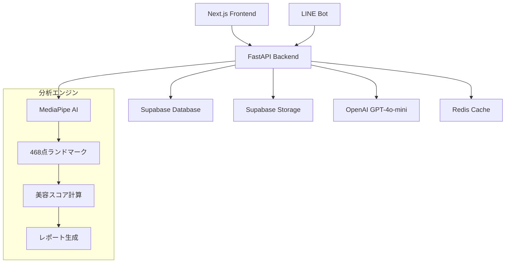

# Face Aesthetic AI 🎭✨

**次世代AI顔面美容分析プラットフォーム**

最先端のAI技術と韓国美容の専門知識を組み合わせた、包括的な美容分析・相談サービスです。

[](https://python.org)
[](https://fastapi.tiangolo.com)
[](https://nextjs.org)
[](https://www.typescriptlang.org)
[](https://docker.com)

## 🌟 主要機能

### 🔬 **高精度AI分析**
- **468点顔面ランドマーク**検出（MediaPipe）
- **8つの美容指標**による科学的分析
- **韓国美容基準**に基づく評価システム
- **黄金比理論**との比較分析

### 💬 **AI美容コンサルテーション**
- **ChatGPT-4o-mini**搭載の専門AI
- **韓国美容のプロ**による個別アドバイス
- **リアルタイム相談**機能
- **パーソナライズされた**改善提案

### 📊 **美しいレポート生成**
- **ビジュアル診断レポート**（matplotlib + PIL）
- **レーダーチャート**での比較表示
- **詳細スコア**ブレークダウン
- **改善アドバイス**付きレポート

### 📱 **マルチプラットフォーム対応**
- **Next.js Webアプリ**（レスポンシブデザイン）
- **LINE Bot**統合（画像分析 + AI相談）
- **Future: Flutter**モバイルアプリ対応予定

## 🏗️ システム構成



## 🚀 クイックスタート

### 前提条件

- **Docker & Docker Compose** (最新版)
- **Node.js 18+** (ローカル開発時)
- **Python 3.12+** with uv (ローカル開発時)

### 1. リポジトリクローン

```bash
git clone https://github.com/your-username/face-aesthetic-app.git
cd face-aesthetic-app
```

### 2. 環境変数設定

```bash
# バックエンド環境変数
cp backend/.env.example backend/.env

# フロントエンド環境変数  
cp frontend/.env.example frontend/.env.local
```

**重要な環境変数:**
```env
# Supabase (必須)
SUPABASE_URL=https://your-project.supabase.co
SUPABASE_KEY=your-anon-key
SUPABASE_SERVICE_KEY=your-service-role-key

# OpenAI (必須)
OPENAI_API_KEY=sk-your-openai-key
OPENAI_MODEL=gpt-4o-mini

# LINE Bot (オプション)
LINE_CHANNEL_ACCESS_TOKEN=your-line-token
LINE_CHANNEL_SECRET=your-line-secret
```

### 3. 開発環境起動

```bash
# 開発環境（ホットリロード対応）
docker compose -f docker-compose.yml -f docker-compose.dev.yml up

# または本番環境
docker compose --profile production up -d
```

### 4. アクセス

- **フロントエンド**: http://localhost:3000
- **バックエンドAPI**: http://localhost:8000
- **API ドキュメント**: http://localhost:8000/docs
- **健康状態確認**: http://localhost:8000/health

## 🛠️ 開発環境

### ローカル開発

```bash
# バックエンド開発
cd backend
uv sync
uv run uvicorn app.main:app --reload

# フロントエンド開発
cd frontend  
npm install
npm run dev

# テスト実行
cd backend
uv run pytest tests/ -v
```

### Docker開発環境

```bash
# 開発用（ホットリロード + デバッグ）
docker compose -f docker-compose.yml -f docker-compose.dev.yml up

# ログ確認
docker compose logs -f backend
docker compose logs -f frontend

# コンテナに接続
docker compose exec backend bash
docker compose exec frontend sh
```

## 🧪 テスト

### 自動テスト

```bash
# バックエンドテスト
cd backend
uv run pytest tests/ -v --cov=app

# 特定のテスト
uv run pytest tests/test_analysis.py -v

# テストカバレッジ
uv run pytest --cov=app --cov-report=html
```

### 手動テスト

```bash
# API健康確認
curl http://localhost:8000/health

# 分析エンドポイント
curl -X POST "http://localhost:8000/api/v1/analysis/analyze" \
  -F "file=@test_image.jpg"

# LINE Bot情報
curl http://localhost:8000/api/v1/linebot/info
```

## 🔧 設定・環境別デプロイ

### Supabase設定

1. [Supabase](https://supabase.com)でプロジェクト作成
2. `backend/app/schemas/supabase.py`のSQLを実行
3. ストレージバケット作成（`face-analysis-images`, `analysis-reports`）
4. RLSポリシー設定

### LINE Bot設定

1. [LINE Developers](https://developers.line.biz/)でチャンネル作成
2. Webhook URL設定: `https://your-domain.com/api/v1/linebot/webhook`
3. 必要な権限を有効化

### 本番デプロイ

```bash
# Vercel (フロントエンド)
cd frontend
vercel --prod

# Railway/Render (バックエンド)
# Dockerfileを使用してデプロイ

# フルスタックDocker
docker compose --profile production up -d
```

詳細な設定は [DEPLOYMENT_GUIDE.md](./DEPLOYMENT_GUIDE.md) を参照してください。

## 📁 プロジェクト構造

```
face-aesthetic-app/
├── 🎨 frontend/                 # Next.js フロントエンド
│   ├── src/
│   │   ├── app/                 # App Router
│   │   ├── components/          # Reactコンポーネント
│   │   ├── hooks/               # カスタムフック
│   │   ├── lib/                 # ユーティリティ
│   │   └── types/               # TypeScript型定義
│   └── public/                  # 静的ファイル
│
├── 🚀 backend/                  # FastAPI バックエンド
│   ├── app/
│   │   ├── api/v1/              # APIエンドポイント
│   │   ├── core/                # 分析エンジン
│   │   ├── models/              # Pydanticモデル
│   │   ├── services/            # ビジネスロジック
│   │   └── utils/               # ユーティリティ
│   └── tests/                   # テストスイート
│
├── 🐳 Docker設定
│   ├── docker-compose.yml       # 本番環境
│   ├── docker-compose.dev.yml   # 開発環境
│   └── nginx/                   # リバースプロキシ
│
├── 📚 docs/                     # ドキュメント
├── 🗂️ legacy/                   # レガシーファイル
└── 📋 設定ファイル
```

## 🔄 Redis の役割

### なぜRedisが必要？

1. **🚀 パフォーマンス向上**
   ```python
   # 分析結果のキャッシュ（10分間）
   redis.setex(f"analysis:{image_hash}", 600, analysis_result)
   ```

2. **⚡ レート制限**
   ```python
   # APIレート制限（1分間に10回）
   redis.incr(f"rate_limit:{user_id}", ttl=60)
   ```

3. **💾 セッション管理**
   ```python
   # チャットセッションのキャッシュ
   redis.hset(f"chat_session:{session_id}", session_data)
   ```

4. **🔄 非同期タスク**
   ```python
   # 重い分析処理のキューイング
   redis.lpush("analysis_queue", task_data)
   ```

### Redis使用例

- **分析結果キャッシュ**: 同じ画像の再分析を防止
- **APIレート制限**: 悪用防止とサーバー保護
- **LINE Bot応答**: メッセージの重複処理防止
- **セッション管理**: ユーザー状態の高速アクセス

## 🔐 セキュリティ

- **🛡️ CORS設定**: 許可されたドメインのみ
- **🔑 環境変数**: 機密情報の安全な管理
- **🚫 レート制限**: DDoS攻撃防止
- **✅ 入力検証**: Pydanticによる厳密な検証
- **🔒 SSL/TLS**: HTTPS通信の強制

## 🤝 コントリビューション

1. **Fork** the repository
2. **Create** your feature branch (`git checkout -b feature/amazing-feature`)
3. **Commit** your changes (`git commit -m 'Add amazing feature'`)
4. **Push** to the branch (`git push origin feature/amazing-feature`)
5. **Open** a Pull Request

### 開発ガイドライン

- **コードスタイル**: Ruff (backend), Prettier (frontend)
- **型チェック**: mypy (backend), TypeScript (frontend)
- **テスト**: pytest (backend), Jest (frontend)
- **コミット**: Conventional Commits形式

## 📄 ライセンス

このプロジェクトは [MIT License](LICENSE) の下で公開されています。

## 📞 サポート

- **🐛 バグ報告**: [Issues](https://github.com/your-username/face-aesthetic-app/issues)
- **💡 機能リクエスト**: [Discussions](https://github.com/your-username/face-aesthetic-app/discussions)
- **📧 お問い合わせ**: support@face-aesthetic.ai

## 🙏 謝辞

- **MediaPipe** - Google の顔面ランドマーク検出
- **OpenAI** - GPT-4o-mini AI技術
- **Supabase** - バックエンドインフラ
- **LINE** - メッセージングプラットフォーム

---

<div align="center">

**Made with ❤️ in Tokyo, Japan**

[🌐 Website](https://face-aesthetic.ai) • [📱 LINE Bot](https://line.me/R/ti/p/@face-aesthetic) • [📧 Contact](mailto:team@face-aesthetic.ai)

</div>